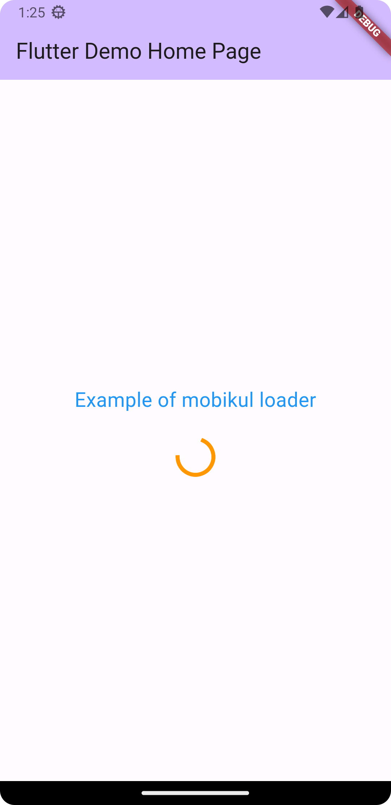

# Mobikul 
Mobikul is a leading mobile app development company that delivers innovative and high-quality mobile applications across various industries. Discover more at [https://mobikul.com/flutter-app-development/](https://mobikul.com/flutter-app-development/) and bring your app ideas to life with us.


## Mobikul Loader
A quick way to show a loader with message.

### Features
A simple and effective widget that shows circular progress indicator along with a message, on the current screen itself
You can customize the message, font color, font size and the color of the circular progress indicator. 

### Getting started

Add the latest version of package to your pubspec.yaml (and run`dart pub get`):
```yaml
dependencies:
  mobikul_loader_package: ^0.0.3
```

### Usage

```dart
import 'package:mobikul_loader_package/mobikul_loader_package.dart';
```

After importing the above line in your code, you can use the loader just like you use any other widget.

Usage - 1 --> Showing only Circular Progress indicator in a dialog
```dart
MobikulLoader()
```

Usage - 2 --> Showing Circular Progress indicator with a message

```dart
MobikulLoader( message : " Your text message goes here")
```
Usage - 3 --> Customized Loader with message 

```dart
MobikulLoader( message : " Your text message goes here", loaderColor: Colors.green , fontColor: Colors.black, fontSize: 24)
```

